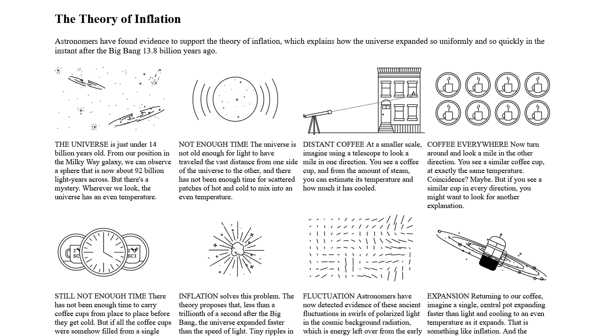

# Floating and Positioning Elements

> In this project we were asked to recreate a page from the New York Times website.

#Please keep in mind the resolution of my screen is 1920x1080. Kindly setup the window accordingly.

We were to use float, flexbox and other positioning and styling techniques to make our web page resemble the target web page as closely as possible. 

## Built With

- HTML, CSS

## Live Demo

[Live Demo Link](https://mistermaxis.github.io/Floating-Elements-1/)

## Getting Started

**This is an example of how you may give instructions on setting up your project locally.**
**Modify this file to match your project, remove sections that don't apply. For example: delete the testing section if the currect project doesn't require testing.**

To get a local copy up and running follow these simple example steps.

### Prerequisites

Computer with internet conexion

### Setup

Clone or zip the Github project

### Install

Double click index.html

### Run tests

Terminal commands: [npm i] to install dependencies | [npx hint .] to run Webhint | [npx stylelint "**/*.{css,scss}"] to run Styleint

### Deployment

Upload index.html, style.css and the assets folder to a hosting server

## Authors

👤 **Author**

- GitHub: [@mistermaxis](https://github.com/mistermaxis)

## 🤝 Contributing

Contributions, issues, and feature requests are welcome!

Feel free to check the https://github.com/mistermaxis/Floating-Elements-1/issues.

## Show your support

Give a ⭐️ if you like this project!

## Acknowledgments

- Hat tip to anyone whose code was used
- Inspiration
- etc

## 📝 License

This project is [MIT](lic.url) licensed.
